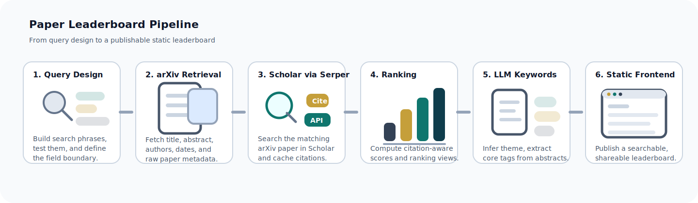

# Paper Leaderboard For You

<p align="center">
  
</p>

为你自己的领域搭建一个论文排行榜。


这个仓库提供的是一套**可复用流程**，包括下面这些环节：

- 领域搜索词设计
- arXiv 论文抓取
- 引用量补全
- 排名计算
- 关键词标注
- 静态前端展示

目标不是单纯收集论文，而是帮你做出一个真正可复用、可展示的领域论文榜单。

[English](./README.md) | [示例](https://dreamfallenflowers.github.io/Paper-Leaderboard-For-Robot-Manipulation/)


## 这个仓库包含什么

- 可复用的 pipeline 脚本
- 示例配置文件
- 关键词策略文档
-规范关键词库
- 一个静态前端参考


## 开始之前

先记住两件事：

- 想要检索结果靠谱，必须先认真设计 `config/queries.yaml`
- 想要在得到引用量，必须配置 `SERPER_API_KEY` 或 `SERPER_API_KEYS`

安装唯一的依赖：

```bash
python -m pip install -r requirements.txt
```

## 动手制作你的论文排行榜

### 流程总览

<p align="center">
  
</p>

1. 先为你的领域构建搜索关键词和 query 表达式
2. 用这些 query 去检索 arXiv 论文元信息
3. 通过 Serper API 搜索 Google Scholar 中对应 arXiv 论文的引用量
4. 基于引用量计算论文分数和排名
5. 对于最基础的 demo 来说，关键词是可选增强；但如果你想做一个真正可筛选、可探索、可发布的 leaderboard，它几乎是必需的
6. 构建前端站点数据并发布排行榜

**其中，只有 Serper API 设置以及关键词检索策略需要你真正地动手**，其他部分大模型都有着很好的表现，这使得整个流程异常简单。


### 构建查询词

修改 `config/queries.yaml`。

这就是你的手工检索方案。
它决定了到底抓到哪些论文。

更合理的做法是：

- 先梳理你领域里的术语、任务名、模型家族、邻近概念
- 手工测试这些短语
- 再把它们整理成 query block
- 最后写进 `config/queries.yaml`

然后再用这些 query 去抓 arXiv 的 title、abstract、authors、published date 等基础信息。

修改 `config/taxonomy.yaml`。

这个文件定义了：

- 根主题名称
- 子主题名称
- 生成页面时使用的简短描述

修改 `config/keywords.yaml`。

这个文件**不是**规范关键词库。
它是 pipeline 用来做 phrase-level relevance 和 subtopic matching 的配置。


## 关键词提取策略

这套模板默认假设你使用的是**受规范关键词库约束的关键词流程**。

关键词提取通常是**整套流程里最困难的一环**。

如果你只是想跑一个最简版本，它在技术上可以暂时跳过。

但如果你想让这个 leaderboard 支持关键词筛选这个使用的功能，关键词基本上是绕不过去的核心环节。

大体逻辑是：

- 先判断论文 theme
- 再从标题和摘要里抽 candidate concepts
- 再把 candidate 映射到规范关键词库
- 最后只保留真正描述核心贡献的标签

请看：

- `config/keyword_extraction_policy.md`
- `config/canonical_keywords_library.md`
- `config/canonical_keywords_library.yaml`

**你应该修改 `config/keyword_extraction_policy.md`**。

至少需要结合自己的领域去调整：

- theme 应该怎么划分
- 哪些内容应该算关键词

如果这份 policy 不按你的领域去改，那么最后抽出来的关键词往往并不适合真实筛选和排行。

如果你用模型做关键词提取，不要让它自由发明标签，而是要满足关键词库的约束。

还要注意：

- `scripts/pipeline.py` 本身**不会**自动生成 model keywords
- `scripts/build_site_data.py` 只会在关键词文件已经存在时去读取它们
- 关键词提取在真实流程里是一个**显式额外步骤**
- 而这个额外步骤，正式口径上应当是基于 arXiv 摘要的大模型抽取

## 前端参考

`site/` 目录是一个静态前端参考实现。

本地预览：

```bash
cd site
python -m http.server 8000
```

然后打开：

```text
http://127.0.0.1:8000/
```

只有在 `site/data/*.json` 已经生成之后，这个前端才真正有内容可看。

这个参考前端在站点数据生成完成后，支持按发表时间筛选，也支持按关键词筛选。

下面是这个前端中你可能需要修改的地方：

- 标题和文案
- 默认排序文字

### 替换前端关键词别名

修改 `config/site_keywords.yaml`。

它负责前端的 alias 归一化和搜索便利性。

格式大致是：

```yaml
keywords:
  - label: Example Keyword
    aliases:
      - example
      - example keyword
```

如果你不改这里，前端搜索别名对你自己的领域基本没有意义。

## 仓库结构

```text
config/     query、taxonomy、关键词、评分配置
scripts/    抓取 / 重建 / 导出脚本
site/       静态前端参考
topics/     生成出来的 markdown 排名页
data/       本地缓存和输出
```

模板里的 `data/` 目录默认是空的。


## 主要命令

### 完整流程

```bash
python scripts/pipeline.py run
```

抓取、排序、重建输出。

### 只抓 arXiv 原始结果

```bash
python scripts/pipeline.py fetch-only
```

适合先检查检索覆盖率，再决定后续怎么排名。

### 只刷新引用量

```bash
python scripts/pipeline.py refresh-citations
```

适合在已经有 `data/processed/papers.jsonl` 的情况下，单独更新 citation。

当前模板中的实现方式是：

- 通过 **Serper API**
- 去搜索 Google Scholar 中对应的 **arXiv 论文**
- 然后把 citation 信息缓存到本地

### 从已有 raw 文件重建

```bash
python scripts/pipeline.py rebuild-from-raw
```

适合你修改了过滤逻辑或评分逻辑，但不想重新抓 arXiv 的情况。

### 重建前端站点数据

```bash
python scripts/build_site_data.py
```

这一步会生成前端真正可用的 JSON 文件。

### 使用大模型抽取关键词

真实工作流中的关键词抽取步骤是：

- 读取每篇论文的 arXiv 标题和摘要
- 先判断论文 theme
- 抽取体现核心贡献的 candidate concepts
- 再把这些 candidate 映射到规范关键词库
- 最终把关键词结果写到：
- `data/processed/model_keywords/`

以上工作流均由大模型完成，你唯一需要注意的是在开始正式抽取之前检查规则和规范关键词库，具体步骤见 [关键词提取策略](#关键词提取策略)。

推荐的输出形式是按 `arxiv_id` 对齐的 JSONL 关键词文件，这样 `scripts/build_site_data.py` 才能在构建前端数据时直接使用它。

参考命令：

```bash
python scripts/extract_model_keywords.py
```

## 预期输出

处理后的主输出：

- `data/processed/papers.jsonl`
- `data/processed/ranked.csv`
- `data/processed/total_ranked.csv`
- `data/processed/hot_ranked.csv`

前端输出：

- `site/data/papers.min.json`
- `site/data/tags.json`
- `site/data/aliases.json`
- `site/data/stats.json`

生成出来的 markdown 页：

- `topics/index.md`
- `topics/<subtopic>.md`

## 做出你自己的 leaderboard

我一直相信，实打实的引用量，比铺天盖地的宣传更有价值。

制作并发布一个属于你研究领域的 paper leaderboard，将为更多的人提供帮助，欢迎 pull request 并在这里提交你的 papar leaderboard 的仓库链接，要完成这一步，不要忘记在 github 项目主页中添加对应的前端界面。

https://github.com/DreamFallenFlowers/Paper-Leaderboard-For-Robot-Manipulation
